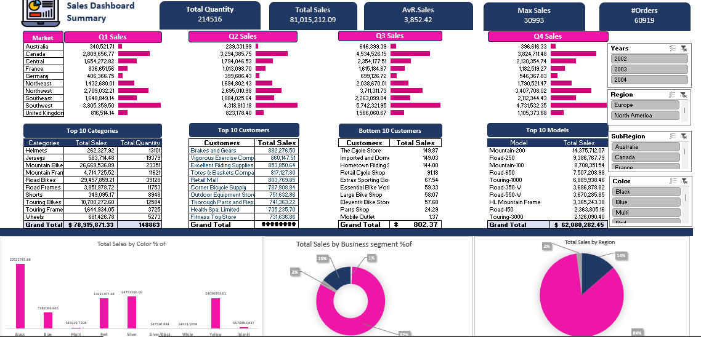

# 📊 Sales Dashboard Summary

This project is an interactive *Excel-based Sales Dashboard* that visualizes key sales metrics such as total sales, quantity, orders, top-performing products, and customer performance across different regions and quarters.

---

## 📁 Project Overview

The dashboard is built using *Microsoft Excel* and leverages tools like:

- Pivot Tables
- Pivot Charts
- Slicers
- Conditional Formatting

These elements work together to provide an intuitive and dynamic overview of sales data.

---

## 📷 Dashboard Preview

Here is a screenshot of the dashboard in action:

---

## 📌 Key Features

- ✅ Quarterly sales breakdown (Q1 - Q4)
- ✅ Top 10 product categories by sales and quantity
- ✅ Top 10 customers and bottom 10 customers
- ✅ Sales breakdown by color, region, and business segment
- ✅ Interactive filtering by:
  - Year
  - Region
  - Subregion
  - Product color

---

## 📊 KPIs Displayed

| Metric             | Value           |
|--------------------|------------------|
| Total Quantity     | 214,516          |
| Total Sales        | $81,015,212.09   |
| Average Sale       | $3,852.42        |
| Max Sale (Single)  | 30,993           |
| Total Orders       | 60,919           |

---

## 📂 Files Included

- SalesDashboard.xlsx – The main Excel file containing the dashboard and data
- README.md – Project documentation file (this file)
- Screenshot hosted on GitHub

---

## ⚙ How to Use

1. Open the SalesDashboard.xlsx file in Microsoft Excel.
2. Use the slicers on the right side to filter the data by year, region, color, or subregion.
3. Watch the KPIs and charts update dynamically based on your selections.

---

## 💡 Insights You Can Derive

- Best and worst-performing customers
- Top-selling product models and categories
- Sales trends by season and region
- Distribution of sales by color and business segment

---

## 🧰 Tools Used

- Microsoft Excel
- Pivot Tables & Pivot Charts
- Slicers
- Conditional Formatting
- Basic formulas and aggregation

---

## 👨‍💻 Author

*Mohamed Khedr*

If you found this dashboard useful or have suggestions, feel free to connect or open an issue in the repository.
